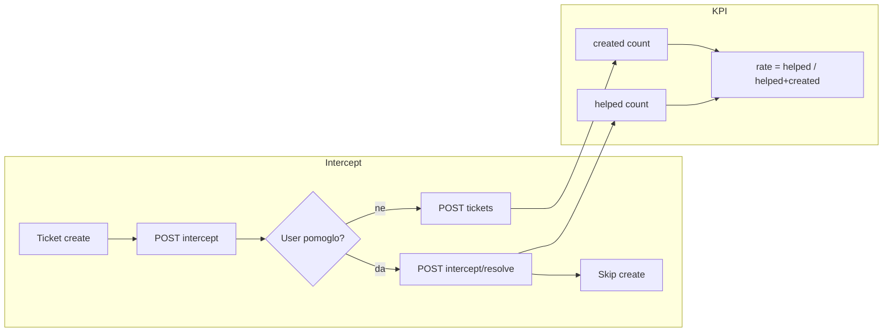

# Knowledge Base — completion plan

## Locked decisions

- **Review podsjetnici**: ulaze odmah (in-app), po uzoru na waiting-for-user `@Interval` sweep.
- **KB resolution rate**: `helpedWithoutCreate / (helpedWithoutCreate + ticketsCreated)` u istom window/OU scope-u; “helped” = eksplicitni intercept resolve (ne thumbs-only).
- **SuperAdmin full admin**: create/edit forme sa svim admin poljima + hard delete; ostale role zadržavaju postojeći uži create + lifecycle/archive.
- **KEEP out**: tags, views, intercepts counter, helpfulPct na listi, “Predloži izmjenu” (nema DTO / nije RAW IN).

## Current baseline (ne dirati osim gdje faza traži)

- BE: CRUD + lifecycle + feedback + intercept ranking — `[knowledge-base.controller.ts](backend/src/modules/knowledge-base/knowledge-base.controller.ts)`, `[knowledge-base-workflow.controller.ts](backend/src/modules/knowledge-base/knowledge-base-workflow.controller.ts)`
- `searchVector` trigger postoji u migraciji; **queryi i dalje ILIKE-style** u `[list-knowledge-articles.ts](backend/src/modules/knowledge-base/list-knowledge-articles.ts)`
- FE: lista/detail/edit/intercept — edit samo title/body; create bez group/reviewer/classification
- Matrica ownership eksplicitno kaže “NIJE podsjetnici” — ažurirati u Fazi 3

---

## Faza 1 — Full-text search (BE + FE wiring)

**Cilj:** RAW `tsvector` + GIN stvarno koristi list/search.

### Task 1.1 — Server-side FTS u list

- U `[list-knowledge-articles.ts](backend/src/modules/knowledge-base/list-knowledge-articles.ts)`: kad `q` nije prazan, filtrirati preko Postgres FTS na `searchVector` (`plainto_tsquery('simple', …)` / `@@`), rang opcionalno `ts_rank` za order; prazan `q` ostaje postojeći `orderBy updatedAt`.
- Zadržati authorization visibility loop; ne curiti van `canRead`.
- Testovi: title hit, body hit, prazan query, scope.

### Task 1.2 — FE šalje query parametre

- Proširiti `[listKnowledgeArticles](frontend/src/services/knowledge-base-api.ts)` na `{ q?, status?, serviceId? }`.
- `[knowledge-base-page.tsx](frontend/src/pages/knowledge-base-page.tsx)`: debounce `q`/filteri → server fetch; client filter ostaje samo kao thin fallback za `staleOnly` (nema BE query param još) ili dodati `staleOnly` query na BE ako je jeftino u istoj fazi.
- Ukloniti lažni hint “rangirano po korisnosti” na listi **ili** zamijeniti copy da odražava FTS/updatedAt (ranking po feedbacku ostaje samo intercept).

### Task 1.3 — Matrica

- Nova ili update: `.cursor/docs/matrices/knowledge-base-search/` ili dopuna ownership matrice — FTS path, namjerno NIJE semantic.

---

## Faza 2 — SuperAdmin full administracija

**Cilj:** SuperAdmin create = full, edit = full, brisanje = hard delete.

### Task 2.1 — Hard delete (BE)

- `DELETE /knowledge-base/articles/:articleId` + body `{ reason }` (isti pattern kao lifecycle).
- Dozvola: **samo `SUPER_ADMIN`** (RoleGuard), ChangeLog prije brisanja, cascade feedback već na FK.
- Archive ostaje za write/publish role (soft remove iz kataloga).

### Task 2.2 — Full create/edit forme (FE)

- Shared admin fields (postojeći DTO već podržava): `ownerUserId` XOR `ownerGroupId`, `reviewerUserId`, `classification`, plus create: `serviceId`, `organizationalUnitId`.
- Groups: `[listGroups](frontend/src/services/groups-api.ts)`.
- Prikaz full forme kad je `session.isSuperAdmin` / `SUPER_ADMIN`; ostali: postojeći uži create + edit title/body.
- Detail: Delete CTA samo SuperAdmin (confirm + reason).

### Task 2.3 — Edit šalje ownership/classification

- FE `[updateKnowledgeArticle](frontend/src/services/knowledge-base-api.ts)` + forma; BE `[UpdateKnowledgeArticleDto](backend/src/modules/knowledge-base/dto/update-knowledge-article.dto.ts)` već ima polja — provjeriti da update path stvarno persistira (već u `[update-knowledge-article.ts](backend/src/modules/knowledge-base/update-knowledge-article.ts)`).

---

## Faza 3 — Review podsjetnici

**Cilj:** In-app podsjetnik owneru kad se bliži/ističe `reviewDueAt`.

### Task 3.1 — Settings

- `private.knowledgeBase.reviewCycle.remindDaysBefore` (number, default **14**) u `[knowledge-base-settings.ts](backend/src/modules/settings/definitions/knowledge-base-settings.ts)` + loader/parse.

### Task 3.2 — Sweep servis

- `KnowledgeBaseReviewReminderService` sa `@Interval` (isti stil kao `[WaitingForUserAutomationService](backend/src/modules/tickets/waiting-for-user/waiting-for-user-automation.service.ts)`).
- Kandidati: `status=PUBLISHED`, `reviewCycle.enabled`, `reviewDueAt <= now + remindDaysBefore`.
- Recipienti: `ownerUserId` ili članovi `ownerGroupId`.
- Persist preko `[persistInAppNotification](backend/src/modules/notifications/fan-out/persist-in-app-notification.ts)`; novi tip `knowledge.reviewDue` u `[notifications.constants.ts](backend/src/modules/notifications/notifications.constants.ts)`.
- Dedupe: `kb-review:{articleId}:{reviewDueAt.toISOString()}` — jedan reminder po due ciklusu; nakon `approve-review` (novi `reviewDueAt`) novi ključ.

### Task 3.3 — Matrica

- Update `[knowledge-base-ownership-review-cycle/MATRIX.md](.cursor/docs/matrices/knowledge-base-ownership-review-cycle/MATRIX.md)` + CHANGELOG: ukloniti “NIJE podsjetnici”; dokumentovati interval, dedupe, settings.

---

## Faza 4 — Intercept resolve + KB resolution rate

**Cilj:** Persist “pomoglo bez create” i KPI na reports dashboard.

### Task 4.1 — Persist model + API

- Prisma model npr. `KnowledgeInterceptResolution`: `id`, `userId`, `serviceId`, `organizationalUnitId` (iz actora ili service scope), opcionalno `primaryArticleId`, `createdAt`; index `(createdAt)`, `(organizationalUnitId, createdAt)`.
- `POST /knowledge-base/intercept/resolve` `{ serviceId, articleId? }` — authenticated; ne blokira ništa; idempotency po session nije obavezna (svaki klik = jedan prevented ticket).
- FE: u `[create-ticket-form.tsx](frontend/src/components/tickets/create-ticket-form.tsx)` / intercept panel, `onHelped` poziva resolve **prije** skip create (uz postojeći thumbs feedback koji ostaje odvojen).

### Task 4.2 — KPI agregacija

- Proširiti `[ReportDashboardKpis](backend/src/modules/reports/dashboard/aggregate-report-dashboard-kpis.ts)`: `kbHelpedCount`, `kbResolutionRate` (0–1 ili percent; konzistentno s FE).
- Formula (locked): `rate = helped / (helped + created)` u window; `null` ako `helped + created === 0`.
- OU scope isti kao ostali report dashboard loadersi.
- FE: nova StatCard u `[reports-metric-grid.tsx](frontend/src/components/reports/reports-metric-grid.tsx)`.

### Task 4.3 — Matrica

- Update intercept matrice: resolve endpoint + KPI definicija; namjerno NIJE brojanje samog thumbs-up-a kao resolution.

---

## Faza 5 — FE polish (dozvoljeno)

**Cilj:** Referenca bez KEEP-out izmišljotina.

- Empty state: “Novi članak za {query}” (prefill title) kad SuperAdmin/write.
- Subtitle: broj `IN_REVIEW` + `isStale` iz učitane liste (bez fake intercept totals).
- Opcijski: vratiti `viewerFeedback` na `GET` article / list item za active thumbs (ako jeftino uz Fazu 4; inače samo detail).

---

## Redoslijed implementacije

1 → 2 → 3 → 4 → 5 (svaka faza zaseban commit-able slice; Faza 5 može ići paralelno s 4 nakon FE API stabilnosti).

## Van scope-a ovog plana

- Semantic search, tags/categories/views/helpfulPct/intercept counters, email podsjetnici, “Predloži izmjenu”, paralelni ACL.
